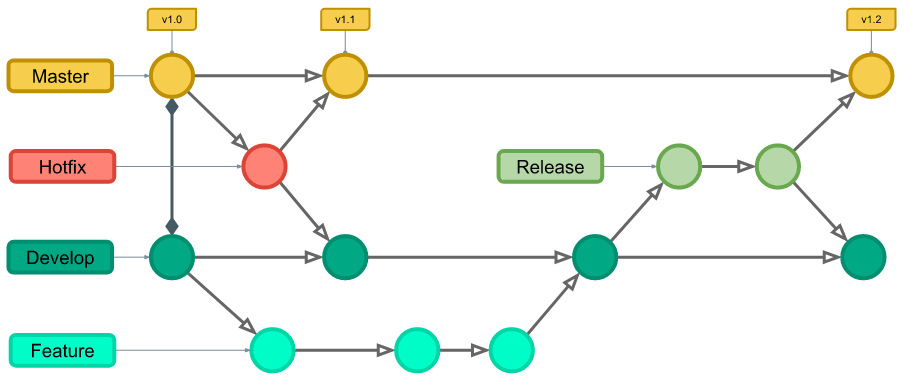

# ClimaTech

Este projeto está em desenvolvimento ativo. Todas as novas funcionalidades e correções devem seguir o fluxo de trabalho definido com o uso de GitFlow.



- [Estrutura do Projeto](.github/doc/Geral.md)

## Requisitos do Ambiente

Para rodar o projeto localmente, certifique-se de ter a seguinte ferramenta instalada:

- ⚠️ Em Breve!
  
## Instalação

1. Clone o repositório:

```bash
git clone https://github.com/Maia-th/ClimaTech.git
cd ClimaTech
```

## Instale as dependências do projeto:

- ⚠️ Em Breve!

## Inicie o projeto:

- ⚠️ Em Breve!

## Fluxo de Desenvolvimento

Este projeto segue o modelo GitFlow para organização das branches e fluxo de desenvolvimento.

- `main`: Branch principal que contém o código em produção.
- `develop`: Branch de desenvolvimento com o código que será testado antes de ir para a produção.
- `feature` branches: Cada nova funcionalidade ou melhoria deve ser desenvolvida em uma branch de feature (feature/nome-da-feature).
- `hotfix` branches: Correções de bugs urgentes devem ser feitas em branches específicas (hotfix/nome-do-hotfix).

Passos para contribuir com uma nova feature ou correção

1. Crie uma nova branch a partir de develop:

```bash
git checkout -b feature/nome-da-feature develop
```
2. Desenvolva a funcionalidade ou correção de bug.

3. Ao concluir, faça o commit das suas alterações:

```bash
git add .
git commit -m "feat: Descrição da feature ou correção"
```
4. Faça o push da branch:

```bash
git push origin feature/nome-da-feature
```
5. Abra um Pull Request (PR) para a branch develop.

## Regras para Aprovação de PR

- Todo PR deve ser revisado e aprovado por dois desenvolvedores antes de ser mesclado à branch develop.
- O código será revisado para verificar a qualidade, adesão às práticas do projeto e testes adequados.
- Somente após a aprovação dos dois revisores, o PR será aceito e mesclado.